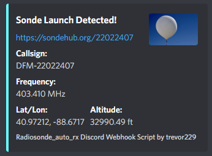

# auto_rx_discord_webhook
Script that listens for Horus UDP packets from radiosonde_auto_rx and notifies of launched sondes via discord webhook

This script is meant to be run on the same Pi you have auto_rx running on. I run the script (Python 3) using systemd and the included service file. I will admit its not great, and it only keeps a volatile list of sonde IDs in a dict, but considering the turnaround time of sondes, it should be fine. At worst, stopping and re-running gives another webhook embed.

## Requirements
* discord_webhook

## Install
* `cd /home/pi`
* `wget https://raw.githubusercontent.com/trevor229/auto_rx_discord_webhook/main/auto_rx_discord_webhook.py`
* `wget https://raw.githubusercontent.com/trevor229/auto_rx_discord_webhook/main/auto_rx_discord_webhook.service`
  * Make sure you dont need to change anything in the service before copying, otherwise if edited, remember to rerun daemon-reload!
* `sudo mv auto_rx_discord_webhook.service /etc/systemd/system/`
* `sudo systemctl daemon-reload`
* `sudo systemctl enable auto_rx_discord_webhook.service`
* `sudo systemctl start auto_rx_discord_webhook.service`

Check to see if its running

* `sudo systemctl status auto_rx_discord_webhook.service`
